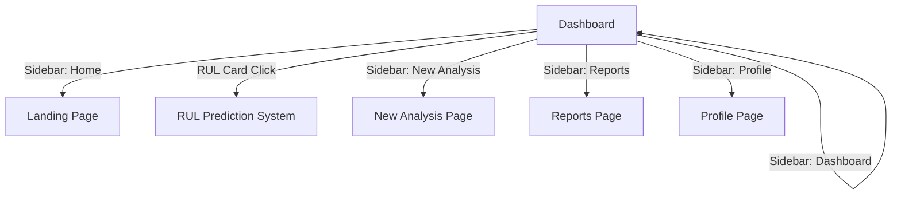

# Design Document: Dashboard UX Intelligence Enhancement

## Overview

This design implements intelligent UX behaviors and navigation enhancements for the Data Scientist Dashboard without modifying the existing visual design. The enhancement focuses on micro-interactions, behavioral intelligence, and seamless navigation flows using React, Framer Motion, and React Router.

The design maintains complete visual consistency with the existing design system while adding behavioral intelligence through:
- Hover-activated sidebar navigation
- Smart logo home button
- Intelligent search bar with rotating placeholders
- Data source status display
- Enhanced module card interactions
- Seamless RUL Prediction navigation

All enhancements leverage existing Framer Motion animations and styling utilities to ensure zero visual changes while maximizing interaction intelligence.

## Architecture

### Component Structure

```
Dashboard (existing)
├── Sidebar (new component)
│   ├── Navigation items with icons and labels
│   └── Hover expansion/collapse logic
├── Header (modified)
│   ├── Logo with click handler (modified)
│   └── Data Sources Status (new)
├── Search Bar (modified)
│   ├── Rotating placeholder logic
│   └── Focus/blur handlers for card fade
└── Module Cards Grid (modified)
    ├── Enhanced hover interactions
    ├── RUL Prediction click navigation
    └── Opacity fade on search focus
```

### State Management

The design uses React's built-in state management (useState, useEffect) for:
- Sidebar expansion state (hover-driven)
- Search bar focus state (for card fade effect)
- Placeholder rotation index (for cycling examples)
- Navigation state (React Router's useNavigate)

No external state management library is required as all state is local to the Dashboard component.

### Navigation Flow



## Components and Interfaces

### 1. Sidebar Component

**Purpose:** Provide space-efficient navigation that expands on hover

**Props:**
```typescript
interface SidebarProps {
  currentPath: string  // Current route for active state highlighting
}
```

**State:**
```typescript
const [isExpanded, setIsExpanded] = useState(false)
```

**Navigation Items:**
```typescript
const navItems = [
  { id: 'dashboard', icon: '🧠', label: 'Dashboard', path: '/dashboard/data-scientist' },
  { id: 'home', icon: '🏠', label: 'Home', path: '/' },
  { id: 'new-analysis', icon: '➕', label: 'New analysis', path: '/dashboard/new-analysis' },
  { id: 'reports', icon: '📊', label: 'Reports', path: '/dashboard/reports' },
  { id: 'profile', icon: '👤', label: 'Profile', path: '/dashboard/profile' }
]
```

**Behavior:**
- Default width: 64px (icon-only)
- Expanded width: 200px (icon + label)
- Transition duration: 200ms
- Uses Framer Motion's `animate` prop for smooth width transition
- `onMouseEnter`: setIsExpanded(true)
- `onMouseLeave`: setIsExpanded(false)

**Styling:**
- Position: fixed left side
- Background: `bg-card-bg/80 backdrop-blur-xl` (existing glassmorphism)
- Border: `border-r border-border-subtle`
- Z-index: 50 (above background, below modals)

### 2. Logo Smart Home Button

**Modification:** Add click handler and hover effect to existing logo

**Implementation:**
```jsx
<motion.img 
  src="/public/assets/Intellectus-logo-2D.jpeg"
  alt="Intellectus AI Labs"
  className="h-16 w-auto object-contain cursor-pointer"
  onClick={() => navigate('/dashboard/data-scientist')}
  whileHover={{ 
    filter: 'drop-shadow(0 0 12px rgba(201, 103, 49, 0.6))'
  }}
  transition={{ duration: 0.2 }}
/>
```

**Behavior:**
- Click: Navigate to `/dashboard/data-scientist`
- Hover: Apply glow using existing accent-primary color
- Cursor: pointer

### 3. Search Bar with Rotating Placeholders

**State:**
```typescript
const [placeholderIndex, setPlaceholderIndex] = useState(0)
const [isSearchFocused, setIsSearchFocused] = useState(false)

const placeholders = [
  "Why did sales drop last month?",
  "Predict churn for Q2",
  "Optimize pricing"
]
```

**Placeholder Rotation Logic:**
```typescript
useEffect(() => {
  if (!isSearchFocused) {
    const interval = setInterval(() => {
      setPlaceholderIndex((prev) => (prev + 1) % placeholders.length)
    }, 4000)
    return () => clearInterval(interval)
  }
}, [isSearchFocused])
```

**Implementation:**
```jsx
<motion.input
  type="text"
  placeholder={placeholders[placeholderIndex]}
  onFocus={() => setIsSearchFocused(true)}
  onBlur={(e) => {
    if (e.target.value === '') {
      setIsSearchFocused(false)
    }
  }}
  className="w-full px-6 py-4 bg-card-bg/80 backdrop-blur-xl border border-border-subtle rounded-xl text-text-primary placeholder:text-text-muted focus:border-accent-primary focus:ring-2 focus:ring-accent-primary/20 transition-all duration-300"
  animate={{
    placeholder: placeholders[placeholderIndex]
  }}
/>
```

**Behavior:**
- Rotate placeholders every 4 seconds when not focused
- Pause rotation when search bar has focus
- Trigger card fade effect on focus

### 4. Data Sources Status Display

**Component:**
```jsx
<div className="flex items-center gap-3 text-sm">
  <div className="relative group">
    <div className="flex items-center gap-2 text-text-body">
      <span className="text-green-500">🟢</span>
      <span className="font-medium">Live data connected (2 sources)</span>
    </div>
    <div className="text-text-muted text-xs mt-0.5">
      Last sync: 2 min ago
    </div>
    
    {/* Tooltip on hover */}
    <motion.div
      initial={{ opacity: 0, y: 5 }}
      whileHover={{ opacity: 1, y: 0 }}
      className="absolute top-full left-0 mt-2 px-3 py-2 bg-card-bg/95 backdrop-blur-xl border border-border-subtle rounded-lg text-xs whitespace-nowrap opacity-0 group-hover:opacity-100 transition-opacity duration-200 pointer-events-none"
    >
      View sources → Add new source →
    </motion.div>
  </div>
</div>
```

**Position:** Below search bar, above module cards

### 5. Enhanced Module Cards

**Hover Interaction Modifications:**

```jsx
<motion.div
  key={module.id}
  onClick={() => {
    if (module.id === 'rul-prediction') {
      navigate('/dashboard/rul-prediction')
    }
  }}
  whileHover={{ 
    y: -6,  // Lift 6px
    boxShadow: module.recommended 
      ? '0 20px 80px rgba(201, 103, 49, 0.5)' 
      : '0 20px 60px rgba(201, 103, 49, 0.3)'
  }}
  animate={{
    opacity: isSearchFocused ? 0.7 : 1
  }}
  transition={{ duration: 0.3 }}
  className="relative bg-card-bg/80 backdrop-blur-xl rounded-2xl p-8 shadow-card border cursor-pointer group"
>
  {/* Card content */}
  <h3 className="text-2xl font-bold text-text-primary mb-3 group-hover:font-extrabold transition-all duration-300">
    {module.title}
  </h3>
  
  <p className="text-text-body font-normal leading-relaxed mb-6 group-hover:opacity-60 transition-opacity duration-300">
    {module.description}
  </p>
  
  {/* Rest of card content */}
</motion.div>
```

**Card Fade Effect:**
- Controlled by `isSearchFocused` state
- Fade to 70% opacity when search is focused
- Return to 100% opacity when search loses focus and is empty
- Transition duration: 200ms

**Microtext Above Cards:**
```jsx
<p className="text-sm text-text-muted font-medium mb-4 text-center">
  Recommended workflows
</p>
```

### 6. RUL Prediction Navigation

**Implementation:**
- Add onClick handler to RUL Prediction card
- Navigate to `/dashboard/rul-prediction` using React Router's `navigate()`
- Entire card surface is clickable
- Maintain existing CTA text and styling

**Route Setup (in App.jsx):**
```jsx
<Route path="/dashboard/rul-prediction" element={<RULPrediction />} />
```

**Placeholder RUL Prediction Page:**
```jsx
// Create new file: frontend/src/pages/RULPrediction.jsx
export default function RULPrediction() {
  return (
    <div className="min-h-screen bg-app-bg">
      {/* Consistent header and styling with Dashboard */}
      <div className="max-w-7xl mx-auto px-6 py-12">
        <h1 className="text-4xl font-bold text-text-primary mb-4">
          RUL Prediction System
        </h1>
        <p className="text-text-body">
          Predict equipment failures and optimize maintenance schedules with AI.
        </p>
      </div>
    </div>
  )
}
```

## Data Models

### Navigation Item Model

```typescript
interface NavigationItem {
  id: string           // Unique identifier
  icon: string         // Emoji icon
  label: string        // Display label
  path: string         // Route path
}
```

### Module Card Model (existing, no changes)

```typescript
interface ModuleCard {
  id: string
  title: string
  roleLabel: string
  description: string
  cta: string
  recommended: boolean
  icon: JSX.Element
}
```

### Search Placeholder Model

```typescript
interface SearchPlaceholder {
  text: string         // Placeholder text
  index: number        // Position in rotation
}
```

## Correctness Properties

*A property is a characteristic or behavior that should hold true across all valid executions of a system—essentially, a formal statement about what the system should do. Properties serve as the bridge between human-readable specifications and machine-verifiable correctness guarantees.*

